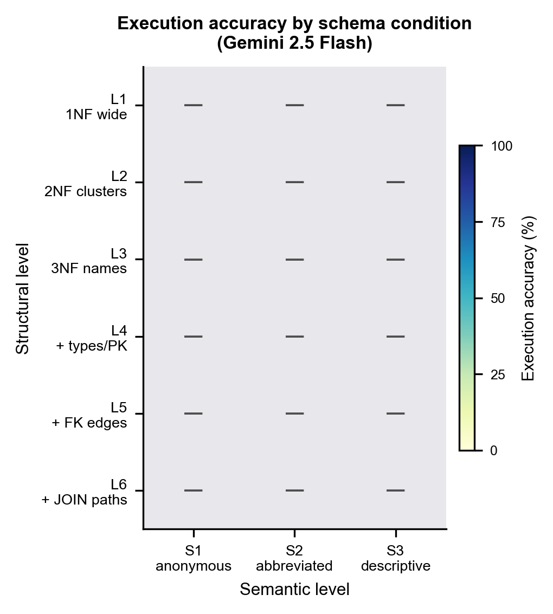
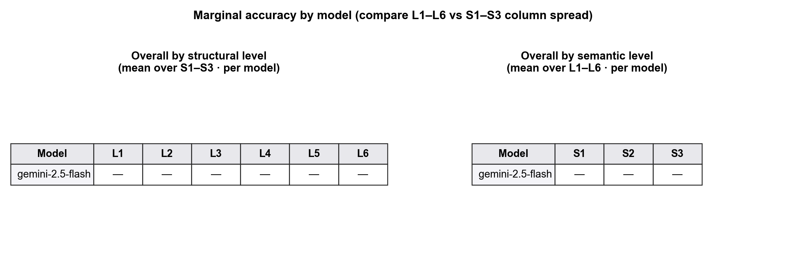
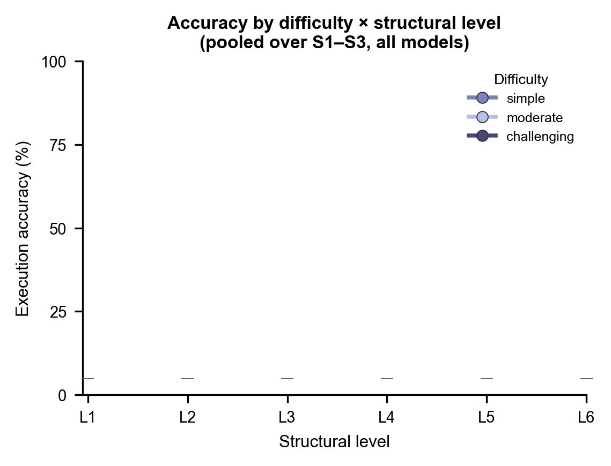
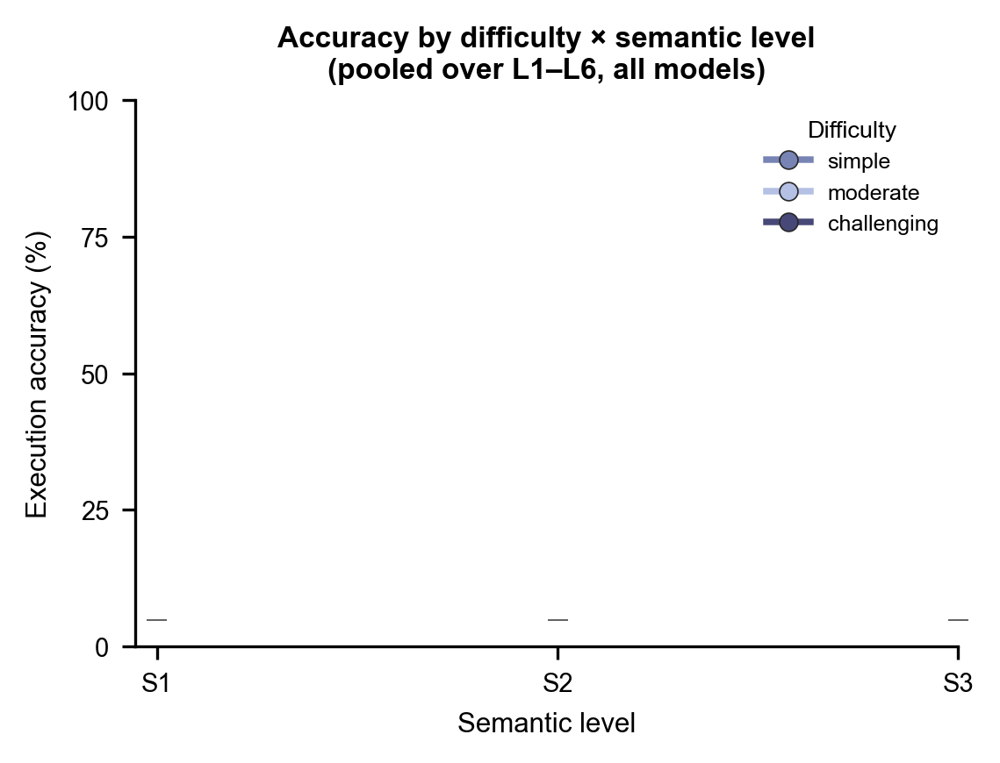
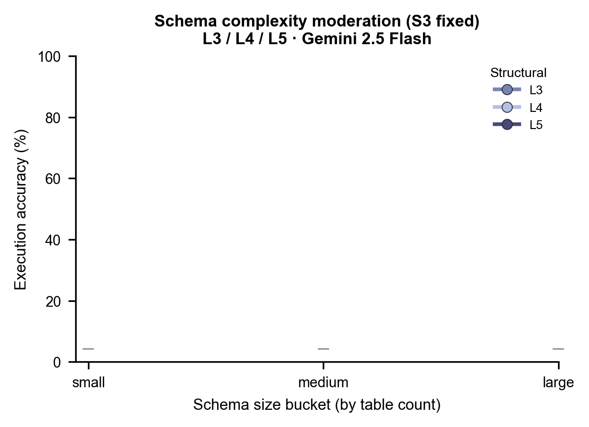
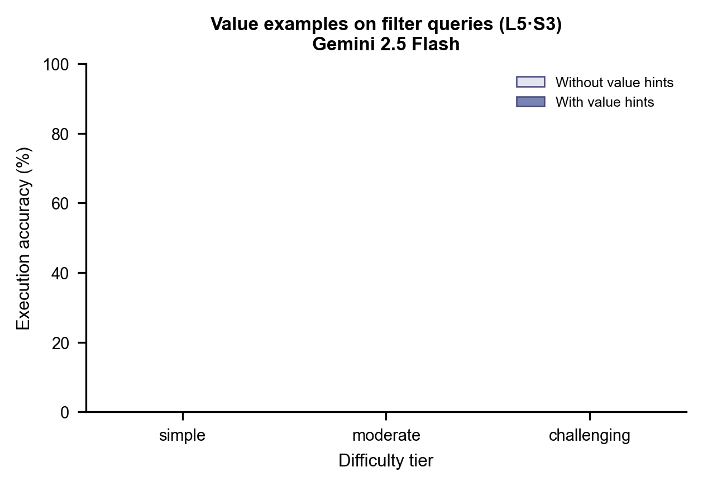
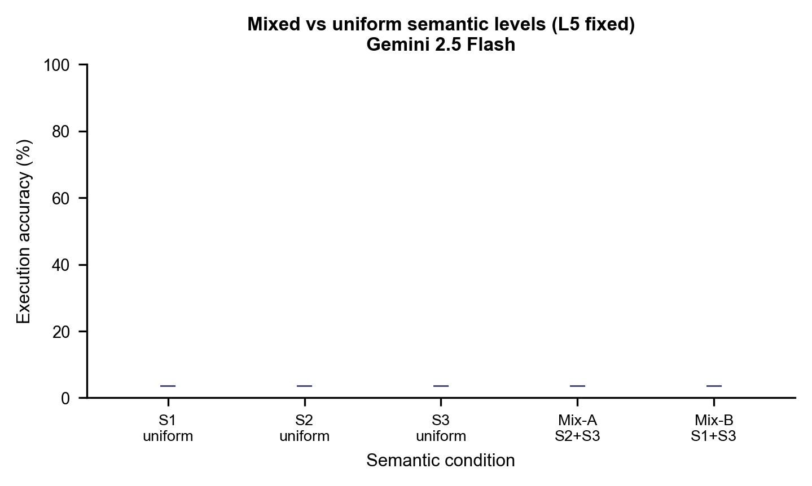

# Schema-Effect Experiment Design (Implementation Phase)

This document is the **operational experiment protocol** for the schema-effect study, aligned with the original research design (`research_design.pdf`) but updated for the implemented pipeline. It supersedes the original **6×4** factorial on semantics: **S4 (descriptive + column descriptions) is dropped**, yielding a **6×3 = 18-condition** main experiment.

**Primary model (wave 1):** `gemini-2.5-flash`  
**Figure backend:** Python / matplotlib (publication-style templates per the nature-figure workflow)

---

## 1. Research questions

| ID | Question |
|----|----------|
| **RQ1** | How does **structural observability** in the schema prompt (L1→L6) affect execution accuracy? |
| **RQ2** | How does **semantic richness** of column naming (S1→S3) affect execution accuracy? |
| **RQ3** | Are structural and semantic effects **independent**, or do they interact (compensation / amplification)? |

The **hero figure** for RQ1–RQ3 is the **6×3 accuracy heatmap** (Section 6).

---

## 2. Independent variables

### 2.1 Structural level (6 levels)

Each level adds one category of schema information relative to the previous 3NF ladder step (L3–L6). L1–L2 use **materialised denormalised SQLite** files; L3–L6 use the native BIRD 3NF database with **prompt-only** schema text.

| Level | Label | What the model sees |
|-------|--------|---------------------|
| **L1** | 1NF wide table | Single denormalised table per DB (`{db}__1nf.sqlite`); denormalisation notice in prompt |
| **L2** | 2NF clusters | Multiple wide cluster tables (`{db}__2nf.sqlite`); denormalisation notice |
| **L3** | 3NF baseline | Table names + column names only |
| **L4** | 3NF + metadata | L3 + SQLite types, `PRIMARY KEY`, `NOT NULL` |
| **L5** | L4 + relations | L4 + inline FK comments with cardinality |
| **L6** | L5 + join paths | L5 + explicit `JOIN PATHS` block |

### 2.2 Semantic level (3 levels — S4 removed)

| Level | Label | Column naming in prompt |
|-------|--------|-------------------------|
| **S1** | Anonymous | `col_a`, `col_b`, … (position-based per table) |
| **S2** | Abbreviated | Short legacy-style aliases (`cust_id`, …) |
| **S3** | Descriptive | Full English / original curated names |

### 2.3 Full factorial (18 conditions)

Conditions are pairs `(structural_level, semantic_level)` with structural ∈ {1…6} and semantic ∈ {1,2,3}.

```
              S1          S2          S3
         ┌─────────┬─────────┬─────────┐
    L1   │  L1·S1  │  L1·S2  │  L1·S3  │
    L2   │  L2·S1  │  L2·S2  │  L2·S3  │
    L3   │  L3·S1  │  L3·S2  │  L3·S3  │
    L4   │  L4·S1  │  L4·S2  │  L4·S3  │
    L5   │  L5·S1  │  L5·S2  │  L5·S3  │
    L6   │  L6·S1  │  L6·S2  │  L6·S3  │
         └─────────┴─────────┴─────────┘
```

---

## 3. Dependent variables and outcomes

| Metric | Definition | Source column |
|--------|------------|---------------|
| **Execution accuracy** | Fraction of questions where predicted SQL is **executable** and **result set matches** gold (BIRD-style) | `correct` |
| **Outcome label** | `correct` / `wrong_answer` / `error` / … | `outcome` |
| **Valid SQL rate** | Share with `outcome != error` | derived |
| **Latency / cost** | Not logged in CSV v1 | — |

**Stratification (post hoc, no extra runs):** `difficulty` (simple / moderate / challenging), `question_type`, `db_id`.

**Inference:** question-level **bootstrap 95% CI** on accuracy (`analysis/bootstrap_accuracy_ci.py`).

---

## 4. Controlled factors (held constant)

| Factor | Setting |
|--------|---------|
| Temperature | 0 |
| Passes per question | 1 |
| Prompt template | `src/prompt_builder.py` (L1–L2 include denormalisation notice) |
| Evidence field | Not shown to the model |
| Benchmark SQL | Gold from `arcwise_plat_sql.json` |
| Evaluation | `src/evaluator.py` (execution + multiset compare; L1/L2 on materialised DB) |

---

## 5. Question set and databases

### 5.1 Question source

- **Questions:** `dev_20240627/arcwise_plat_sql.json` (NL question + gold SQL).
- **Metadata join:** `dev.json` (`difficulty`), `preprocess_data/questions/question_types.json` (`question_type`).

### 5.2 Main question set (current default in `run_experiment.py`)

**All** questions in `arcwise_plat_sql.json` whose `db_id` is one of the **9 materialised databases**, excluding `card_games` and `codebase_community`:

| `db_id` | n (arcwise) |
|---------|-------------|
| `california_schools` | 30 |
| `debit_card_specializing` | 30 |
| `european_football_2` | 51 |
| `financial` | 30 |
| `formula_1` | 66 |
| `student_club` | 48 |
| `superhero` | 52 |
| `thrombosis_prediction` | 50 |
| `toxicology` | 40 |

**Total per condition:** **N = 397** questions.


### 5.3 L1/L2 database coverage

L1/L2 materialised schemas exist for **9 databases** (`MATERIALISED_DB_IDS` in `src/schema_builder.py`). Questions whose `db_id` is not in that set **must not** be paired with L1/L2 unless you add specs and rebuild SQLite.

---

## 6. Primary charts (templates — fill after run)

### 6.1 Figure contract

| Panel | Chart | Question it answers |
|-------|--------|---------------------|
| **A** | 6×3 heatmap | Joint structural × semantic effects (per model) |
| **B–C** | Overall marginal tables (by model) | Which dimension has **larger marginal impact**? Compare L1→L6 vs S1→S3 spread per model |
| **D** | Difficulty × structural (lines) | Does structural observability matter **more for harder** queries? |
| **E** | Difficulty × semantic (lines) | Does semantic richness interact with difficulty **the same way** as structure? |

**Fill rules**

- **Per-condition cell (heatmap):** `100 × (# correct) / N` from one `results/{model}__L{l}S{s}.csv`.
- **§6.3 structural cell (model *m*, L*i*):** mean `correct` for model *m* at `structural_level = i`, pooled over **S1–S3** only (one row per model).
- **§6.3 semantic cell (model *m*, S*j*):** mean `correct` for model *m* at `semantic_level = j`, pooled over **L1–L6** only.
- **Difficulty lines:** same pooling as above, but filter `difficulty ∈ {simple, moderate, challenging}` before aggregating.

Wave 1 uses a single model (`gemini-2.5-flash`); “all models” collapses to that model until later waves add rows from other `results/{model}__*.csv` files.

### 6.2 Heatmap (6 × 3)



|  | **S1** | **S2** | **S3** |
|--|--------|--------|--------|
| **L1** | 0.3% | 32.7% | 33.8% |
| **L2** | 0.3% | 38.8% | 39% |
| **L3** | 4.5% | 38.8% | 40.8% |
| **L4** | 9.1% | 39.3% | 40.6% |
| **L5** | 16.9% | 38% | 40.3% |
| **L6** | 15.6% | 39.8% | 39% |

*Replace `—` with accuracy (%) and optional bootstrap margin, e.g. `42.0 ± 3.2`.*

**Axes:** x = semantic level (S1–S3); y = structural level (L1–L6).  
**Legend / colorbar:** execution accuracy (%), 0–100.  
**Title:** Execution accuracy by schema condition (per model; wave 1 = Gemini 2.5 Flash).

### 6.3 Overall accuracy by structural vs semantic level (model × level tables)



**Purpose:** Compare the **marginal effect size** of each dimension **per model**, in the same layout as a standard results table (reference: Fewshot × Model × 1NF/2NF/3NF, but here **Model** replaces Fewshot). Place the **structural** and **semantic** tables **side by side**. The dimension with a **larger spread** across columns (L1→L6 vs S1→S3) is the **dominant** dimension for that model.

**Cell format:** `accuracy (±margin)` with accuracy in **[0, 1]** and margin = half-width of bootstrap 95% CI (e.g. `0.42 (±0.03)`). Use `—` until filled.

**Left table — overall by structural level (mean over S1–S3 per model)**

| Model | L1 | L2 | L3 | L4 | L5 | L6 |
|-------|----|----|----|----|----|-----|
| gemini-2.5-flash | — | — | — | — | — | — |
| *(add rows per model in later waves)* | | | | | | |

*Aggregation:* for each model, pool all `results/{model}__L{i}S*.csv` rows at fixed `structural_level = i` (all semantic levels).

**Right table — overall by semantic level (mean over L1–L6 per model)**

| Model | S1 | S2 | S3 |
|-------|----|----|-----|
| gemini-2.5-flash | — | — | — |
| *(add rows per model in later waves)* | | | |

*Aggregation:* for each model, pool all `results/{model}__L*S{j}.csv` rows at fixed `semantic_level = j` (all structural levels).

**Interpretation:** For each model, compare column-wise range on the left (L1–L6) vs the right (S1–S3). Steeper cross-column change → stronger marginal effect for that dimension.

### 6.4 Accuracy by difficulty tier — structural dimension (line chart)



**Purpose:** Does **structural observability** matter more for **harder** queries? If challenging queries show a steeper L1→L6 slope than simple queries, structure helps most when the task is difficult.

| Difficulty | L1 | L2 | L3 | L4 | L5 | L6 |
|------------|----|----|----|----|----|-----|
| simple | — | — | — | — | — | — |
| moderate | — | — | — | — | — | — |
| challenging | — | — | — | — | — | — |

*Aggregation per cell:* mean `correct` where `difficulty` matches and `structural_level = L*k*`, pooled over S1–S3 and all models.

**Axes:** x = structural level (L1–L6); y = execution accuracy (%).  
**Legend:** simple / moderate / challenging (three lines).

### 6.5 Accuracy by difficulty tier — semantic dimension (line chart)



**Purpose:** Same question as §6.4 for **semantic richness**. Compare line separation and slopes to §6.4: if challenging queries gain more from S1→S3 than simple ones, semantics and difficulty interact; if the pattern differs from the structural chart, the two dimensions behave differently under difficulty.

| Difficulty | S1 | S2 | S3 |
|------------|----|----|-----|
| simple | — | — | — |
| moderate | — | — | — |
| challenging | — | — | — |

*Aggregation per cell:* mean `correct` where `difficulty` matches and `semantic_level = S*k*`, pooled over L1–L6 and all models.

**Axes:** x = semantic level (S1–S3); y = execution accuracy (%).  
**Legend:** simple / moderate / challenging (three lines).

### 6.6 Regenerate all figure templates

```bash
cd schema_effect
MPLBACKEND=Agg MPLCONFIGDIR=analysis/.mplconfig \
  .venv/bin/python analysis/plot_experiment_templates.py
```

Outputs under `docs/figures/`:

| File stem | Chart |
|-----------|--------|
| `main_experiment_gemini-2.5-flash_heatmap` | §6.2 |
| `main_experiment_overall_marginal_tables` | §6.3 |
| `main_experiment_difficulty_by_structure` | §6.4 |
| `main_experiment_difficulty_by_semantics` | §6.5 |

After runs, fill arrays in `analysis/plot_experiment_templates.py` (or extend the script to load `results/*.csv`) and re-run the command above.

---

## 7. Wave 1 run protocol — Gemini 2.5 Flash

### 7.1 Configuration (`run_experiment.py`)

Set before launch:

```python
CONDITIONS = [
    (1, 1), (1, 2), (1, 3),
    (2, 1), (2, 2), (2, 3),
    (3, 1), (3, 2), (3, 3),
    (4, 1), (4, 2), (4, 3),
    (5, 1), (5, 2), (5, 3),
    (6, 1), (6, 2), (6, 3),
]

MODELS = [
    "gemini-2.5-flash",
]
```

**API key:** `GEMINI_API_KEY` in `schema_effect/.env` (see `.env.example`).

**Rate limit:** `MODEL_DELAY["gemini-2.5-flash"] = 1` s between calls (adjust if you hit 429s).

### 7.2 Outputs

One CSV per (model, condition):

```text
results/gemini-2.5-flash__L{struct}S{sem}.csv
```

Example: `results/gemini-2.5-flash__L3S2.csv`

Columns: `question_id`, `db_id`, `difficulty`, `question_type`, `structural_level`, `semantic_level`, `model`, `gold_sql`, `predicted_sql`, `outcome`, `correct`, `error_msg`.

Checkpointing: existing rows are skipped on resume.

### 7.3 Run size (wave 1)

| Quantity | Value |
|----------|--------|
| Conditions | 18 |
| Questions per condition | 397 |
| Estimated wall time @ 1 s/call | ~30 min + evaluation overhead |

### 7.4 Launch

```bash
cd schema_effect
# ensure .env has GEMINI_API_KEY
# ensure L1/L2 SQLite built for sampled DBs if running L1/L2
python run_experiment.py
```

### 7.5 Post-run: fill tables and figures

Per-condition accuracy:

```bash
.venv/bin/python analysis/bootstrap_accuracy_ci.py results/gemini-2.5-flash__L3S3.csv
# or all: results/gemini-2.5-flash__*.csv
```

**§6.2 heatmap:** one accuracy per `(model, L, S)` CSV.  
**§6.3 tables:** per `model`, pool by `structural_level` (cols L1–L6) or `semantic_level` (cols S1–S3).  
**§6.4–6.5 difficulty lines:** same pool, additionally group by `difficulty`.

---

## 8. Condition reference sheet

| Condition | Output file | Structural content | Semantic naming |
|-----------|-------------|--------------------|-----------------|
| L1·S1 | `…__L1S1.csv` | 1NF wide + notice | Anonymous |
| L1·S2 | `…__L1S2.csv` | 1NF wide + notice | Abbreviated |
| L1·S3 | `…__L1S3.csv` | 1NF wide + notice | Descriptive |
| L2·S1 | `…__L2S1.csv` | 2NF clusters + notice | Anonymous |
| L2·S2 | `…__L2S2.csv` | 2NF clusters + notice | Abbreviated |
| L2·S3 | `…__L2S3.csv` | 2NF clusters + notice | Descriptive |
| L3·S1 | `…__L3S1.csv` | 3NF names only | Anonymous |
| L3·S2 | `…__L3S2.csv` | 3NF names only | Abbreviated |
| L3·S3 | `…__L3S3.csv` | 3NF names only | Descriptive |
| L4·S1 | `…__L4S1.csv` | + types / PK / NN | Anonymous |
| L4·S2 | `…__L4S2.csv` | + types / PK / NN | Abbreviated |
| L4·S3 | `…__L4S3.csv` | + types / PK / NN | Descriptive |
| L5·S1 | `…__L5S1.csv` | + FK cardinality | Anonymous |
| L5·S2 | `…__L5S2.csv` | + FK cardinality | Abbreviated |
| L5·S3 | `…__L5S3.csv` | + FK cardinality | Descriptive |
| L6·S1 | `…__L6S1.csv` | + JOIN PATHS | Anonymous |
| L6·S2 | `…__L6S2.csv` | + JOIN PATHS | Abbreviated |
| L6·S3 | `…__L6S3.csv` | + JOIN PATHS | Descriptive |

---

## 9. Case studies (overview)

Three **supplementary** analyses from the original research design. They use **extra conditions or filters** on top of the main 6×3 factorial (Section 6). Each has a dedicated figure template under `docs/figures/`.

| § | Study | Figure | Extra runs? |
|---|--------|--------|-------------|
| **1** | Schema complexity moderation | Line chart (L3 / L4 / L5 × size bucket) | No — post hoc on main runs at **S3** |
| **2** | Value examples on filter queries | Before/after bars by difficulty | **Yes** — `+values` vs baseline at best condition |
| **3** | Mixed semantic levels | Five-bar comparison at fixed structure | **Yes** — Mix-A / Mix-B conditions |

**Shared defaults (unless noted):**

- Model: `gemini-2.5-flash` (wave 1); extend to other models later.
- Question set: same 397 arcwise questions (Section 5).
- Metric: execution accuracy; report as **proportion** in [0, 1] on figures or **%** in tables — be consistent within a section.

---

### 1. Schema complexity moderation (line chart)



**Research question:** Does **relation metadata** (L4, L5) help **more on larger schemas**? If the three lines **fan out** as schema size grows, structural detail interacts with complexity. If lines stay **parallel**, structural level does not interact with schema size.

### Design

| Factor | Setting |
|--------|---------|
| Structural levels | **L3, L4, L5** only (3NF ladder; hold join-path hints out) |
| Semantic level | **S3** fixed (descriptive names) |
| Schema size bucket | By **table count** in `dev_tables.json` per `db_id` |
| X-axis | small / medium / large |
| Y-axis | Execution accuracy |
| Lines | One per structural level (L3, L4, L5) |

### Schema size buckets (9 materialised DBs)

Assign each question’s `db_id` to a bucket from table count:

| Bucket | Table-count rule | Databases in arcwise sample |
|--------|------------------|----------------------------|
| **small** | ≤ 5 tables | `california_schools`, `thrombosis_prediction`, `toxicology`, `debit_card_specializing` |
| **medium** | 6–8 tables | `european_football_2`, `financial`, `student_club` |
| **large** | ≥ 9 tables | `superhero`, `formula_1` |

*Adjust cutpoints if you add databases; document any change here.*

### Data table (fill after run)

Accuracy = mean `correct` over questions in bucket, for `results/gemini-2.5-flash__L{l}S3.csv`.

| Bucket | L3 | L4 | L5 |
|--------|----|----|-----|
| small | — | — | — |
| medium | — | — | — |
| large | — | — | — |

*Cell format:* `0.42 (±0.03)` bootstrap half-width optional.

### Interpretation

| Pattern | Conclusion |
|---------|------------|
| Lines **diverge** (gap L3→L5 grows with bucket) | FK/metadata matters more on **complex** schemas |
| Lines **parallel** | Accuracy gain from L4/L5 is **independent** of schema size |
| L4 ≈ L5 at all buckets | Join-path block (L6) may be redundant; focus on L5 in discussion |

### Outputs

- Figure: `figures/casestudy_schema_complexity.{png,svg,pdf}`
- Source CSVs: `results/{model}__L3S3.csv`, `L4S3`, `L5S3`

---

### 2. Value examples effect on filter queries (before/after bar chart)



**Research question:** Can **sample categorical values** in the schema (e.g. `status -- values: active, inactive`) recover accuracy on **filter-heavy** queries where models hallucinate literals?

### Design

| Factor | Setting |
|--------|---------|
| Query subset | **Filter queries** only: gold SQL contains `WHERE` (case-insensitive) |
| Structural × semantic | **Best condition** from main experiment (default **L5·S3**; update after §6.2) |
| Comparison | Same questions, two schema variants: **without** vs **with** value hints |
| X-axis | BIRD difficulty: simple / moderate / challenging |
| Y-axis | Execution accuracy |
| Bars | Two per tier: no hints / with hints; label **Δ** on the “with” bar |

### Conditions to implement / run

| Label | Schema variant | Suggested output file |
|-------|----------------|----------------------|
| **no_values** | L5·S3 baseline (no value lines) | `results/{model}__L5S3.csv` (main run) |
| **with_values** | L5·S3 + inline `-- values: …` on eligible categorical columns | `results/{model}__L5S3_values.csv` *(new)* |

*Implementation note:* value hints are **not** in the main 18-condition grid; add a flag in `schema_builder` / `run_experiment` when you are ready to run §13.

### Data table (fill after run)

| Difficulty | Without hints | With hints | Δ (with − without) |
|------------|---------------|------------|---------------------|
| simple | — | — | — |
| moderate | — | — | — |
| challenging | — | — | — |

*Δ* is also printed on top of the “with hints” bar in the figure.

### Interpretation

| Pattern | Conclusion |
|---------|------------|
| Δ > 0 especially on **challenging** | Value hints reduce literal hallucination under load |
| Δ ≈ 0 on simple, > 0 on hard | Hints matter when filtering is harder |
| Δ ≤ 0 | Hints add noise or distract; revisit which columns get examples |

### Outputs

- Figure: `figures/casestudy_value_examples.{png,svg,pdf}`

---

### 3. Mixed semantic level comparison (bar chart)



**Research question:** Is **inconsistent** naming (mixed S levels within one schema) worse than **uniform** low quality?

### Design

| Factor | Setting |
|--------|---------|
| Structural level | **L5** fixed (3NF + FK metadata; same as original plan) |
| Semantic conditions | Five bars (single run each) |

| Bar | Semantic condition | Definition |
|-----|-------------------|------------|
| **S1** | Uniform anonymous | All columns S1 |
| **S2** | Uniform abbreviated | All columns S2 |
| **S3** | Uniform descriptive | All columns S3 |
| **Mix-A** | Mixed S2 + S3 | ~50% columns abbreviated, ~50% descriptive (deterministic split by column order or hash) |
| **Mix-B** | Mixed S1 + S3 | ~50% anonymous, ~50% descriptive |

### Data table (fill after run)

| Condition | Accuracy | 95% CI |
|-----------|----------|--------|
| S1 (uniform) | — | — |
| S2 (uniform) | — | — |
| S3 (uniform) | — | — |
| Mix-A (S2+S3) | — | — |
| Mix-B (S1+S3) | — | — |

Suggested CSVs: `results/{model}__L5S1.csv`, `L5S2`, `L5S3` (main grid) plus `results/{model}__L5_mixA.csv`, `L5_mixB.csv` *(new)*.

### Interpretation

| Pattern | Conclusion |
|---------|------------|
| Mix-B **< S1** | Inconsistency itself hurts beyond uniform low quality |
| S1 **< Mix-B < S3** | Model treats columns **independently**; partial readability helps |
| Mix-A between S2 and S3 | Moderate mix is tolerable; extreme opacity (S1) drives Mix-B down |

### Outputs

- Figure: `figures/casestudy_mixed_semantics.{png,svg,pdf}`

---
